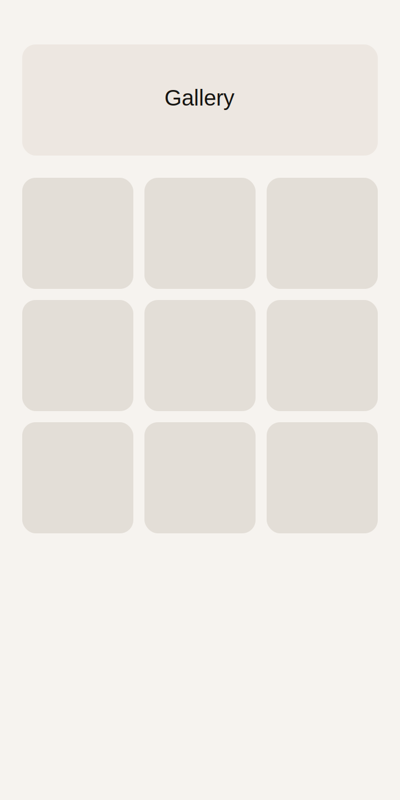
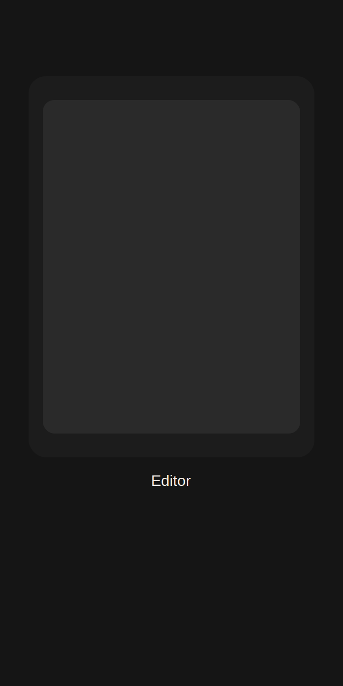

# Luma

First Beta: v0.1.0

Luma — minimalist iOS photo editor

## Screenshots
<p>
  
  
</p>

## Overview
Luma is a minimalist iOS photo editor built with Flutter and a native Core
Image renderer for fast previews and high‑quality exports.

## Features
- Curated signature preset packs
- Fast editor with Light, Color, Effects, Detail, Optics, and Crop
- Crop/rotate/straighten with grid overlay
- Undo/redo history
- Export to Photos

## Run Locally
```bash
flutter pub get
flutter run
```

## Build
```bash
flutter build ios --release
```

## Changelog (v0.1.0)
- Premium editor stage background (dark, consistent)
- Signature preset packs with curated names + descriptions
- Film pack includes "Neutral Scan" anchor preset
- Presets tab updated with larger tiles + saved presets section
- Splash screen held for 2 seconds and matched to iOS LaunchScreen
